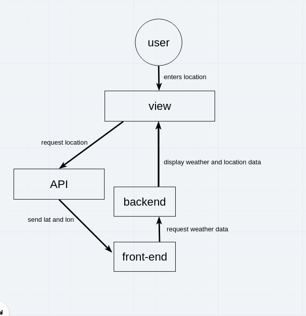

# city-explorer-api

**Author**: Cullen Sharp
**Version**: 1.0.0

## Overview

This is the backend for the city explorer app: an app that gets information about a provided location

## Getting Started

git clone, npm install

## Architecture

## Change Log

## Credit and Collaborations

Tek Jones

## Time Estimates

Name of feature: Set up your server repo

Estimate of time needed to complete: 1hr

Start time: 14:20

Finish time: 14:33

Actual time needed to complete: 13mins

---

Name of feature: Placeholder weather

Estimate of time needed to complete: 1hr

Start time: 14:34

Finish time: 15:40

Actual time needed to complete: 1:10hrs

---

Name of feature: Error revisited

Estimate of time needed to complete: 1hr

Start time: 14:34

Finish time: 15:40

Actual time needed to complete: 1:10hrs

---

Name of feature: Movies

Estimate of time needed to complete: 1hr

Start time: 15:11

Finish time: 15:40

Actual time needed to complete: 29mins

<!--  -->